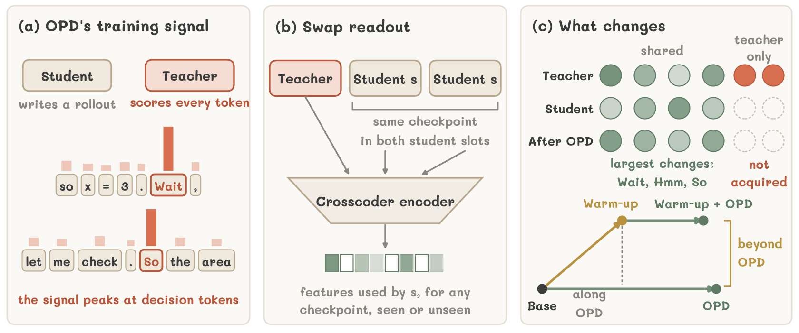

<div align="center">

# Understanding On-Policy Distillation

### A Mechanistic Interpretability Perspective via Sparse Crosscoders

[](https://yzc-666.github.io/understanding-opd-crosscoders/)
[](#citation)
[](crosscoder)


</div>



> **TL;DR.** This work reveals that on-policy distillation improves reasoning primarily by reshaping how
> students use existing representations, offering a mechanistic account of what stronger teachers actually
> teach.

## Crosscoder Training Code

The code to train the crosscoders is in **[`crosscoder/`](crosscoder)**. It builds the shared token
stream, caches the activations of the student, the OPD student, and the teacher, and trains the
heterogeneous BatchTopK crosscoders with the paper's hyperparameters. See
[`crosscoder/README.md`](crosscoder/README.md) for details.

```bash
cd crosscoder && pip install -e .

# 1. shared token stream (200M OpenThoughts + 200M RedPajama tokens)
python -m dictionary_learning.scripts.prepare_opd_crosscoder_tokens \
  --tokenizer /path/to/student --output-dir DATA/tokens

# 2. activations of the three models at a middle layer
bash scripts/collect_activations.sh --token-dir DATA/tokens --cache-dir DATA/cache \
  --student /path/to/student --student-layer 14 \
  --opd /path/to/opd_student --opd-layer 14 \
  --teacher /path/to/teacher --teacher-layer 14

# 3. three-model crosscoder
python -m dictionary_learning.scripts.train_opd_crosscoders \
  --cache-root DATA/cache --output-root DATA/runs
```

## Key Findings

We read each student checkpoint on its own with the **swap readout**, which places its activation in
both student slots of a sparse crosscoder and keeps the teacher's activation fixed. This measures how
training changes the student's use of every feature, even for checkpoints the crosscoder has never seen.

1. **OPD creates no new features.** Across three OPD settings, no feature is gained or lost, and over
   98% of the student's frequently used features change their firing rate by less than 20%.
2. **The teacher's own features stay with the teacher.** The 7B teachers dominate 42 and 30 features.
   OPD does not pass them on: the student's share of their decoder norm is the same before and after
   OPD.
3. **Large changes sit at decision tokens.** Features for words such as *Wait*, *Hmm*, and *So* are
   strongly over-represented among the features OPD changes most, and the teacher disagrees with the
   student most at these words.
4. **The SFT warm-up adds no features either.** SFT on the teacher's own rollouts, which makes OPD more
   effective, keeps every feature shared and gives the student none of the teacher's own features.
5. **It reweights the shared features in two ways.** First, it already raises and lowers many of the
   features that OPD later raises and lowers, doing part of OPD's work in advance. Second, it changes
   features in ways that OPD alone would not, most notably those for the conversation format, the style
   of reasoning, and mathematical notation, and these changes persist through OPD.
6. **This reweighting carries the warm-up's benefit.** Imposing the warm-up's feature change on a
   directly distilled student, without changing any weights, recovers most of the warm-up's benefit;
   removing it from the warmed-up student removes most of it.

## Repository Structure

```
understanding-opd-crosscoders/
├── crosscoder/                    crosscoder training
│   ├── dictionary_learning/       crosscoder model, activation cache, trainer
│   │   └── scripts/               token stream, activation caching, training
│   └── scripts/collect_activations.sh
└── docs/                          project page
```

## Citation

A BibTeX entry will be added when the paper is public.

## Acknowledgements

The crosscoder code builds on
[science-of-finetuning/crosscoder_learning](https://github.com/science-of-finetuning/crosscoder_learning)
and [saprmarks/dictionary_learning](https://github.com/saprmarks/dictionary_learning).
